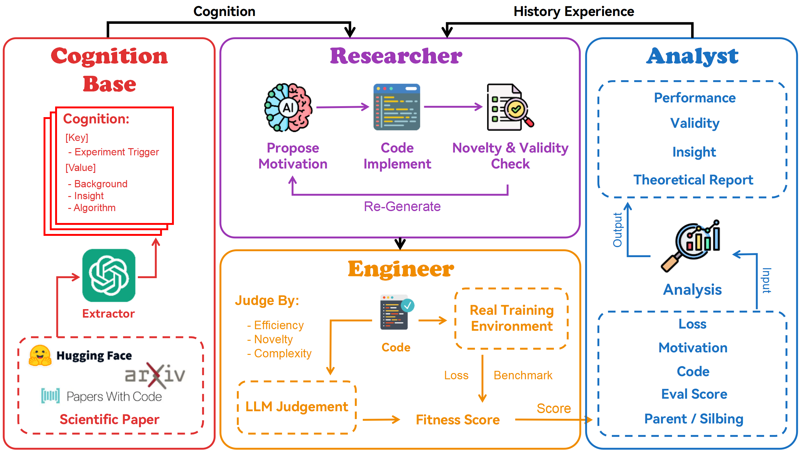
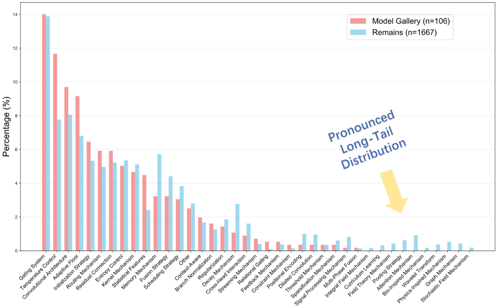

# AlphaGo Moment for Model Architecture Discovery

This is the official repository for our work "AlphaGo Moment for Model Architecture Discovery", an autonomous neural architecture search framework that uses Large Language Models (LLMs) to iteratively design, implement, and evaluate deep learning architectures through evolutionary algorithms and systematic experimentation in the domain of linear attention mechanisms.

## 📝 Introduction

ASI-Arch represents a paradigm shift from traditional Neural Architecture Search (NAS) to autonomous AI research. Unlike conventional NAS methods that are limited to exploring human-defined search spaces, ASI-Arch enables AI to conduct genuine scientific discovery by autonomously hypothesizing novel architectural concepts, implementing them as code, and empirically validating their performance.

The system employs a multi-agent framework where specialized AI agents work collaboratively to evolve neural network architectures through systematic experimentation, performance analysis, and iterative improvement. ASI-Arch has successfully discovered **106 novel, state-of-the-art linear attention architectures** through 1,773 autonomous experiments over 20,000 GPU hours, demonstrating that AI can autonomously generate world-class scientific knowledge.



## 📋 Table of Contents

- [Introduction](#-introduction)
- [Performance](#-performance)
- [Get Started](#-get-started)
- [Acknowledgement](#-acknowledgement)
- [Citation](#️-citation)

## 🏆 Performance

ASI-Arch has successfully demonstrated autonomous architecture discovery capabilities:

### Discovery Statistics
- **1,773 autonomous experiments** conducted over 20,000 GPU hours
- **106 novel architectures** achieving state-of-the-art performance
- **Linear scaling** relationship between compute budget and architecture discovery rate
- **Two-stage validation** from 20M to 340M parameter models




## 🚀 Get Started

### System Requirements

- Python 3.8+
- MongoDB 4.4+
- CUDA-compatible GPU (recommended)
- Minimum 16GB RAM, 32GB recommended

### Installation

```bash
git clone https://github.com/GAIR-NLP/ASI-Arch.git
cd ASI-Arch
conda create -n asi-arch python=3.10
conda activate asi-arch
pip install -r requirements.txt
```

### Core Dependencies

```bash
# Install PyTorch with CUDA support
pip3 install torch==2.4.0 --index-url https://download.pytorch.org/whl/cu124

# Install additional requirements
pip install -r database/requirements.txt
```

### Environment Setup

1. **Configure Database**:
```bash
cd database
chmod +x start_api.sh
./start_api.sh
```

2. **Configure Framework**:
```bash
cd agent
```

### Running Architecture Discovery

```bash
# Execute single evolution cycle
cd agent
python pipeline.py
```

The pipeline automatically:
1. Samples parent architecture from top-50 candidates using fitness-based selection
2. Generates novel architecture variation using Researcher module with cognition retrieval
3. Validates implementation and fixes errors through Engineer module
4. Trains and evaluates architecture across multiple benchmarks
5. Analyzes results and updates candidate pool through Analyst module

## 🙏 Acknowledgement

ASI-Arch is inspired by various open-source projects with its implementation based on [FLAME](https://github.com/fla-org/flame), [LM-Evaluation-Harness](https://github.com/EleutherAI/lm-evaluation-harness) and [Flash Linear Attention (FLA)](https://github.com/sustcsonglin/flash-linear-attention). We deeply appreciate the contributions of these teams to open-source research and development.

## ✍️ Citation

Please cite this work if it contributes to your research:

```bibtex
@article{liu2025alphago_moment,
  title={AlphaGo Moment for Model Architecture Discovery},
  author={Liu, Yixiu and Nan, Yang and Xu, Weixian and Hu, Xiangkun and Qin, Zhen and Liu, Pengfei},
  journal={arXiv preprint},
  year={2025},
  note={Framework for autonomous neural architecture discovery in linear attention}
}
``` 